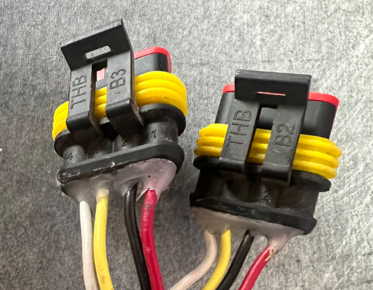
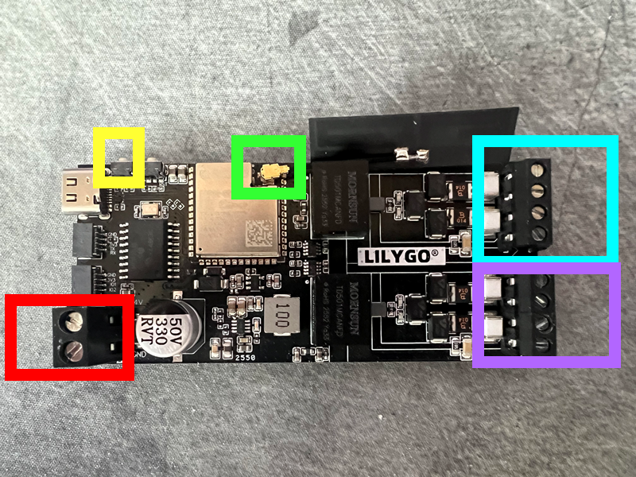
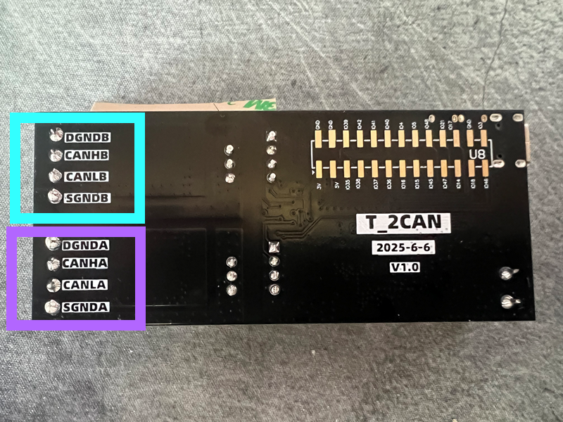
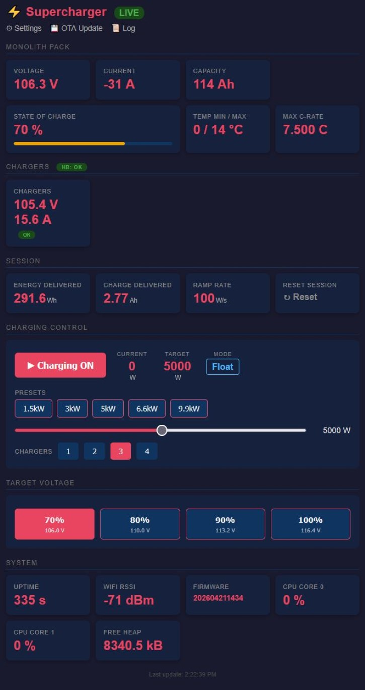
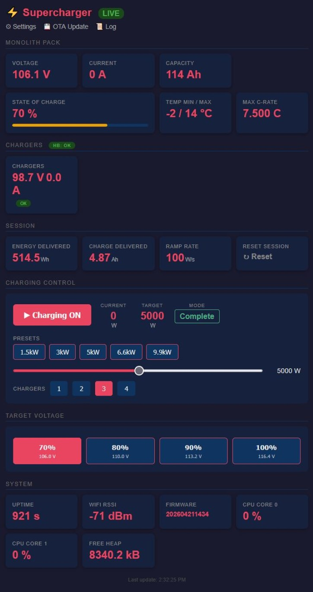
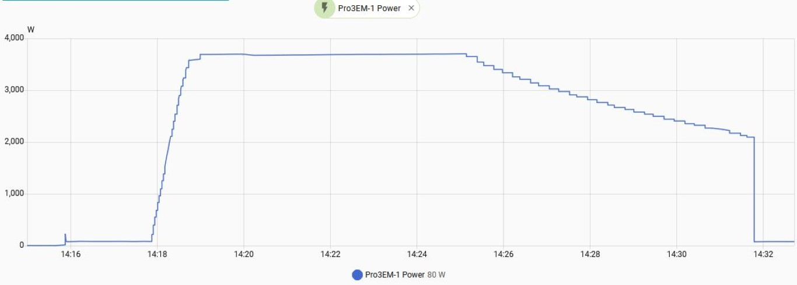
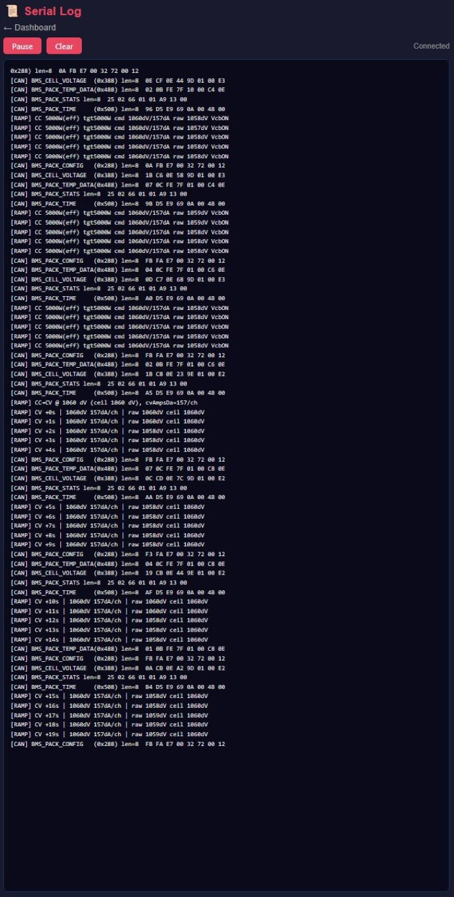

# Supercharger 2.5 - ESP32 Controller

## User Manual

A WiFi connected CAN bus controller for charging a Zero motorcycle with up to 4 Elcon TC HK-J 3300W chargers in parallel. You get a web dashboard, optional Home Assistant integration, and firmware updates over the air.

---

## What You'll Need

- Supercharger 2.5 controller (LilyGo T-2CAN, ESP32-S3 based)
- 1 to 4 Elcon TC HK-J 3300W chargers
- Zero motorcycle with CAN bus access to the BMS
- A 2.4 GHz WiFi network (optional, but recommended)
- A phone, tablet, or laptop with a browser for setup
 - A 5VDC Isolated PSU
 - A prototype board
 - A JAI Electronics MX23A18NF1 connector for the Bike connections
 - Some cables (i have used various.. the inter-board connections i could solve with a screened ethernet patch cord)
 - 2 male SuperSeal connectors:



---

## Connecting the Hardware

**The LilyPad T-2CAN Connections**


In the **Red square** you connect the **red** wire from the chargers to the screw-terminal closest to the USB-C connector. 
You then connect the **black** wire from the same connector to the other terminal, furthest away from the USB-C connector, at the board end.
**Yellow square:** This is the reset button. No connections here, just FYI to where you find it.
**Green square:** You connect the WLAN antenna here. 
**Turqoise square:** You connect the chargers CAN bus here, see seperate image for details.
**Purple square:** You connect the bike's CAN bus here, see seperate image for details.

**The LilyPad CAN Connections**


In the **Turqoise square** you connect the **CANL to the CANLB port** and the **CANH to the CANHB port**. (color code will come later once i have defined the other PCB)
You connect the **GND** cable that is also connected to the **12V-GND** power supply terminals to the **DGNDB** port. 

In the **Purple square** you connect the **CANL -> CANLA port** and the **CANH -> CANHA port** from the bike's CAN bus. Here you will also connect the **separated GND** from bike cable to the **DGNDA port**.

*[MORE TO BE WRITTEN]*

This section covers the 4 pin connector from the Elcon chargers, the 12 VDC supply, CAN bus wiring to the bike, and the splitters used for parallel charger builds.

---

## First Run

Once everything is wired up:

1. Power on the chargers. The 12 VDC from the Elcon cable feeds the controller.
2. The controller boots. Startup takes roughly 2 to 3 seconds.
3. On a fresh unit there are no saved WiFi credentials, so it falls back to AP (setup) mode. If you have connected a laptop to the USB-C port, you'll see a log line on serial saying `No credentials available. Starting AP mode.`
4. Move on to WiFi setup below.

If you want to watch it boot, connect a USB-C cable to the controller and open a serial monitor at 115200 baud.

---

## WiFi Setup (AP Mode)

On first boot, or any time the controller can't find a known network, it creates its own WiFi network for setup.

1. On your phone or laptop, scan for WiFi networks. Look for **Supercharger** (or whatever the builder set as `SECRET_SSID` — see the arduino_secrets.h section below).
2. Connect to it. The default password is **12345678** (or `SECRET_PASS` if the builder set one).
3. Your phone will probably warn you there's no internet. That's fine, ignore it.
4. Open a browser and go to **http://192.168.4.1** or **http://supercharger.local**.
5. You'll see a WiFi Setup page. Enter your home WiFi name (SSID) and password.
6. Hit **Save & Restart**.
7. The controller saves the credentials, reboots, and connects to your home WiFi.

Credentials are stored in non-volatile memory, so you only do this once per network. The AP name and password can also be changed at runtime from the **Settings** page once you're connected — handy if you want a stronger AP password but don't want to reflash.

### Switching to a Different Network Later

If the saved network is gone (moved house, router changed, etc), the controller will try the saved one for 15 seconds, fail, then fall back to AP mode on its own. From there, just redo the setup above with the new credentials.

If the old network is still around and you want to force setup mode anyway, hold the **BOOT** button on the controller for 5 seconds (see the next section). This wipes the saved WiFi credentials and reboots straight into AP mode.

### Using the Controller Without Home WiFi

The controller works fine without internet. It'll sit in AP mode and you can use the dashboard by connecting straight to the AP (default **Supercharger**). Everything local still works:

- Charger monitoring
- Power slider and presets
- Start / stop charging
- Battery data
- Live log viewer

Only Home Assistant integration and OTA updates need internet.

---

## The Buttons on the Controller

The LilyGo board has two small side-mounted buttons: **RST** and **BOOT**.

### RST (Reset)

Hardware reset, wired straight to the chip's enable pin. Pressing it cold-boots the controller — equivalent to cycling the 12 V supply from the chargers, just without unplugging anything. The firmware doesn't see the press; the chip simply restarts. Useful when the dashboard is unreachable and you want a clean restart without pulling cables.

### BOOT (User Reset / Recovery)

This is the one to remember. Two hold patterns are recognised:

| Hold time | Action | What it does |
| --- | --- | --- |
| **5 seconds** (release after 5 s, before 10 s) | Clear WiFi & restart into AP mode | Wipes saved WiFi SSID/password only. AP credentials, MQTT settings, charger count, ramp rate, and target voltage all stay intact. Use this when you need to switch the controller to a new network. |
| **10 seconds** (just keep holding) | Factory reset | Wipes the entire NVS configuration namespace — WiFi credentials, AP credentials, MQTT settings, charger count, ramp rate, target voltage. The controller reboots immediately when the 10 s threshold is hit (you don't need to release), so you'll feel the reset rather than wonder if it took. Use this when re-homing the controller to another bike or troubleshooting a stuck configuration. |

Releases under 1 second are ignored entirely (no accidental triggers from packaging knocks during shipping). Releases between 1 and 5 seconds are logged but take no action.

The BOOT button still doubles as the chip's bootloader entry button if you happen to hold it while pressing RST — that puts the ESP32-S3 into USB download mode, which only matters if you're flashing over USB.

---

## Finding the Dashboard

Once the controller joins your home WiFi, the easiest way in is mDNS:

- **mDNS**: open **http://supercharger.local** in any browser on the same network. Works on Windows 10+, macOS, iOS, Android (most), and any Linux box running Avahi. No IP guessing required. Also works in AP mode — connect to the controller's AP and the same URL resolves to 192.168.4.1.
- **Router-assigned hostname**: the controller now identifies itself as `supercharger` in its DHCP request. If your router auto-registers DHCP client names into your local DNS (OpenWRT, pfSense, UniFi, MikroTik, etc.), the unit will also appear as `supercharger.<your-domain>` — e.g. `supercharger.iotnet` or `supercharger.lan`. This is a separate path from mDNS and works for any client on the network, including ones that don't speak mDNS.

If neither resolves (some corporate or guest networks block multicast and don't auto-register DHCP names), fall back to:

- **Serial log**: connect USB-C and open a serial monitor at 115200 baud. Look for a line like `[WIFI] Connected (prefs). IP: 192.168.1.42`.
- **Router**: log into your router's admin page and check the DHCP client list. The controller usually shows up as "espressif" or similar.

Type the IP into any browser on the same network and the dashboard loads.


---

## Using the Dashboard

The dashboard auto refreshes every 2 seconds.

### Battery Sections

**Monolith Pack** shows voltage, current, capacity, state of charge, and temperature. Always visible.

**PowerTank Pack** shows the same if a PowerTank is present. It's auto detected within 10 seconds of the first bike CAN frame. If it doesn't show up in that window, the section stays hidden.

### Status Banners

A coloured banner across the top of the dashboard tells you when something needs your attention:

- **Red — "No WiFi"**: the controller can't reach your home WiFi and is running its own AP. Reach the dashboard via `http://<ap-ip>` or `http://supercharger.local`. Reconnects automatically when home WiFi comes back.
- **Orange — "Thermal throttling"**: the pack temperature has crossed the hot-cutback threshold and the controller is reducing charging power to keep the cells safe. Charging continues, just slower. The banner clears on its own when the pack cools below the threshold.

### Chargers

One card per detected charger, with voltage, current, and status. Chargers appear automatically within a few seconds of being connected. A heartbeat badge at the top shows whether the controller is successfully talking to the bus.
**NOTE:** The DigiNow pack this was programmed against, came with one(and same) ID programmed towards all 3 chargers. If you have this setup, the system will only detect one charger, but you can set this static as a work-around.

### Charging Control

**ON / OFF button**: enables or disables charging. When disabled, the controller commands zero power immediately, no ramp down.

**Power slider**: set your target power in watts. The controller ramps from current to target at 50 W(adjustable) per second, so jumping from 500 W to 3300 W takes about a minute to get there. This is intentional.

**Preset buttons**: auto scale based on how many chargers you have connected. Just tap one to jump to that power.

Presets per charger count:

| Chargers | Presets (W) |
| --- | --- |
| 1 | 500, 1000, 1650, 2200, 3300 |
| 2 | 1000, 2200, 3300, 5000, 6600 |
| 3 | 1600, 3300, 5000, 6600, 9900 |
| 4 | 2200, 4400, 6600, 9900, 13200 |

**Auto behavior**: when chargers first appear, the controller auto enables charging at the lowest preset. When they all disappear (e.g. you unplug), it auto disables. You don't have to babysit it.

### Charge Limit Presets (% of Full)

Below the power slider you'll find a row of **70 / 80 / 90 / 100 %** buttons. These set the **target pack voltage** — i.e. how full the controller will let the pack get before it stops feeding it. They are the key knob for trading range against pack longevity, and they directly drive the CC / CV state machine described below.

| Preset | Pack voltage ceiling | Roughly what it gives you |
| --- | --- | --- |
| 70 % | 106.0 V | Daily commute / short rides. Easiest on the cells; a useful default if the bike sits for days between rides. |
| 80 % | 110.0 V | Recommended day-to-day setting. Most of the range, much less stress than topping right out. |
| 90 % | 113.2 V | Longer rides. A gentle compromise. |
| 100 % | 116.4 V | Use the day before a long ride or for periodic balancing. The pack will sit slightly hot and at full voltage, which accelerates calendar ageing if you leave it there for days. |

The percentages are based on the Zero monolith pack open-circuit voltage curve (28S Li-ion NMC). The mapping is not perfectly linear with state of charge (Li-ion never is), but it's close enough that "80 %" lands you near 80 % SOC.

The dashboard remembers your last selection across reboots. The same setting is exposed over MQTT (`target_volt_v`) for Home Assistant automations — e.g. set 100 % only the night before a trip.

### Bulk / Absorption / Float — How the Controller Stops Charging

The controller runs a three stage automatic charge cycle, named after the standard solar/battery-charging convention so what's happening on the bike maps to what you'd expect from any other smart charger.


**Stage 1 — Bulk** *(internally CC, "Constant Current")*
This is the main charging phase where most of the energy goes in. The controller commands the chargers to deliver the power you've set on the slider, ramping up at 50 W/s (adjustable). Pack voltage rises gradually as the cells absorb energy. The dashboard phase indicator reads **Bulk**. Voltage and temperature limits (see `battery_tables.h`) only apply in this phase — they trim power back as the pack gets close to full or warm.



**Stage 2 — Absorption** *(internally CV, "Constant Voltage")*
When the pack reaches the target voltage, the controller switches to **Absorption**. It holds the pack at that voltage and lets the chargers reduce current as the cells equalize and finish topping up. You'll see the current target falling on the dashboard while charging continues at a lower level. This stage finishes when one of two things happens, whichever comes first:

- Actual delivered current drops below **2 A total** (after a 2 minute settling window).
- **1 hour safety timeout** finishes.

The 1 hour timeout is generous on purpose — better to give all cells a long, well-paced equalization than to cut absorption short. The absorption stage is short at 70–80 % targets and longer at 90–100 %, because higher charge levels need more time to equalize across the pack. Lower presets shorten or eliminate this stage entirely. That's why 70 % or 80 % charges take proportionally less time. Most cell stress happens during absorption at over 90 % charge — lower presets avoid most of it.



**Stage 3 — Float** *(internally DONE)*
Charging stops, the chargers go silent, and the cells rest. The dashboard shows **Float**. Energy totals (Wh, Ah) stop updating. The controller stays in this stage indefinitely until either the user turns charging off, or the pack sags below the re-engage threshold (see below) and a new cycle starts.

Note that this isn't "float" in the lead-acid sense of holding a maintenance voltage on the pack — Li-ion doesn't want that. It's a *resting* float: the chargers are off and the BMS is left alone. The name keeps the dashboard consistent with what most users already know from solar / RV setups.



Screenshot from my Home Assistant power monitor. This monitor sits in front of the 230 V → 400 V transformer, so the absolute watts aren't precise — but it does cleanly show the bulk ramp-up, absorption taper, and float (charger off) stages.

**Recovery transitions** — the controller doesn't just sit in Float forever:

- **Absorption → Bulk** if pack voltage drops more than 1 V below the limit after switching to Absorption, it switches back to Bulk.
- **Float → Bulk** the threshold depends on the preset you've chosen:
  - **70 % or 80 %**: pack must drop more than **2 V** below the target before a new cycle starts. Frequent small top-offs are fine in this gentle SoC range.
  - **90 %, 100 %**, or any custom target above 110.0 V: the controller waits for the pack to sag all the way down to the **80 % level (110.0 V)** before re-engaging. The cycle is wider (more voltage sag per top-off), but the pack spends far less time hovering near full charge — which is what actually wears Li-ion cells. The trade-off is deliberate: at 100 %, you'll see the pack discharge from 116.4 V down to 110.0 V before the chargers kick back in.

**Already at target when you start**: if you turn charging on and the pack is already at or above the chosen preset's voltage (e.g. you set 80 % but the bike is at 81 %), the controller skips Bulk and Absorption entirely and goes straight to **Float** without ever sending a start command to the chargers. You'll see Float on the dashboard within one tick. The same Float → Bulk re-engage rules above then decide when (if ever) to start a new cycle. No wasted brief charge bursts at the top of the SoC range.

**Practical implication of the % presets**: choosing 70 % doesn't just mean "stop earlier" — it also means a much shorter Absorption phase (or none at all if the ceiling is below where the pack would naturally taper). That's why low presets feel quick: the bulk of cell stress in a Li-ion charge is during Absorption at high voltage, and you're skipping most of it.

### System Info

At the bottom: uptime, WiFi signal, firmware version, CPU load per core, free heap. Useful when you're debugging.

### Log Viewer

Click the Log link, or go to **/log**. Live serial log in your browser, updated in real time. Good for diagnosing CAN bus issues without needing a USB cable.



---

## For Builders: First Time Flashing

### Required Libraries

Install these from the Arduino Library Manager:

- `mcp_can` by coryjfowler
- `PubSubClient` by Nick O'Leary

The rest (`ESPmDNS`, `driver/twai.h`) ship with the Espressif ESP32 Arduino core, no separate install needed.

### Arduino IDE Board Settings

Install ESP32 board support via Boards Manager (search "esp32" by Espressif Systems) if you haven't already. Then match these settings under the Tools menu. These are LilyGo's recommended settings for the T-2CAN:

| Setting | Value |
| --- | --- |
| Board | ESP32S3 Dev Module |
| Upload Speed | 921600 |
| USB Mode | Hardware CDC and JTAG |
| USB CDC On Boot | Enabled |
| USB Firmware MSC On Boot | Disabled |
| USB DFU On Boot | Disabled |
| Upload Mode | UART0 / Hardware CDC |
| CPU Frequency | 240MHz (WiFi) |
| Flash Mode | QIO 80MHz |
| Flash Size | 16MB (128Mb) |
| Partition Scheme | 16M Flash (3MB APP/9.9MB FATFS) |
| Core Debug Level | None |
| PSRAM | OPI PSRAM |
| Arduino Runs On | Core 1 |
| Events Run On | Core 1 |
| Erase All Flash Before Sketch Upload | Enabled |
| JTAG Adapter | Disabled |
| Zigbee Mode | Disabled |

The 3 MB APP partition is what makes OTA work (OTA needs two equal sized app partitions to swap between).

### Compile and Upload

1. Open `Supercharger_ESP32S3.ino` in the Arduino IDE.
2. Edit `arduino_secrets.h` with your credentials (see the next section).
3. Plug the controller into your computer with a USB-C cable.
4. Select the correct port under Tools > Port.
5. Click Upload.

First upload over USB takes a minute or two. After that, you can push updates over the air via `/update` without needing the cable.

### Note on "Erase All Flash Before Sketch Upload"

This one is optional. It's Enabled in the table above because the original build had some early development issues that were solved by clean flashes. It's not a requirement for the firmware to work, and you can safely set it to Disabled if you prefer.

What the setting does: when Enabled, every USB upload wipes all flash including NVS, which is where saved WiFi credentials live. The controller will come back up in AP mode after every upload, and you'll have to redo the WiFi setup page each time. That gets old fast.

Set it to Disabled for a smoother dev loop. Just be aware that old NVS state can become incompatible with new firmware if you ever change the structure of what's stored.

Either way, OTA updates via the web don't touch NVS, so WiFi credentials survive OTA fine.

### ESP32 Arduino Core Version

This firmware has been developed and tested against recent versions of the Espressif ESP32 Arduino core. If something fails to compile, update your ESP32 core to the latest release via Boards Manager and try again. The TWAI and USB CDC APIs have changed across versions, so old cores may not work.

---

## For Builders: arduino_secrets.h

If you're compiling this yourself, you have to set credentials in `arduino_secrets.h` before flashing. You must create your own values. Don't ship with the defaults.

```
#define SECRET_SSID             "Supercharger"     // AP fallback name (optional override)
#define SECRET_PASS             "12345678"         // AP fallback password (optional override, min 8)

#define SECRET_MQTT_SSID        "your-home-wifi"
#define SECRET_MQTT_PASS        "your-wifi-password"
#define SECRET_MQTT_HOST        "192.168.1.100"   // broker IP or hostname
#define SECRET_MQTT_USER        "your-mqtt-user"
#define SECRET_MQTT_BROKER_PASS "your-mqtt-password"

#define SECRET_OTA_USER         "your-ota-username"
#define SECRET_OTA_PASS         "your-ota-password"
```

### Requirements

- **WiFi password must be at least 8 characters**. This is an ESP32 limitation, not mine.
- **OTA user and pass are required**. They protect the `/update` endpoint, as well as charge control, so random people on your network can't reflash or set insane charge values, on/with your controller. Pick something you'll remember but isn't trivial. During creation, this was tested with 32+ characters, so should not be a limiting factor.
- **MQTT credentials are optional**. If you don't use Home Assistant, leave them as empty strings. The MQTT client will keep trying, fail quietly, and not affect anything else.
- **`SECRET_MQTT_SSID` can be blank**. If it is, the controller goes straight to AP mode on first boot. You can still set up WiFi through the setup page. If you set up a WiFi network here, it will automatically set this up and try to connect to it.

### Compile-time AP Defaults (`SECRET_SSID` / `SECRET_PASS`)

`SECRET_SSID` and `SECRET_PASS` set the **default AP name and password** the controller falls back to when no home WiFi is reachable. They override the built-in defaults of `Supercharger` / `12345678`.

The full priority order for the AP credentials is:

1. **NVS** — whatever was last saved via the **Settings** page (highest priority).
2. **`SECRET_SSID` / `SECRET_PASS`** — compile-time defaults from `arduino_secrets.h`.
3. **Built-in defaults** — `Supercharger` / `12345678` (used only if both above are blank).

The point is to let a builder ship a unit with a stronger out-of-the-box AP password than `12345678`, without having to walk a new owner through the Settings page on first boot. If you don't care, just leave `SECRET_SSID` blank and you'll get the built-in defaults.

The same 8-character minimum applies to `SECRET_PASS` as to any WiFi password — that's an ESP32 limitation.

---

## OTA Firmware Updates

Once the controller is on your WiFi:

1. Compile a new firmware in the Arduino IDE and export the compiled `.bin` (Sketch > Export Compiled Binary).
2. Go to **http://\<controller-ip\>/update** in a browser. (or just click the OTA link from Dashboard web page)
3. Enter your OTA username and password (the ones you set in `arduino_secrets.h`).
4. Pick the `.bin` file and click Upload.
5. The controller flashes and reboots automatically.

If the update fails mid way, the old firmware is kept. You won't brick the controller unless the flash itself is cut mid write (e.g. power loss during upload).

---

## Home Assistant Integration

With MQTT credentials set, the controller auto publishes HA discovery topics under `homeassistant/` whenever it connects. A **Supercharger** device shows up in your HA integrations with the following entities (all auto-created — no YAML required):

### Sensors (read only)

| Entity | Unit | What it is |
| --- | --- | --- |
| `monolith_v` / `monolith_a` | V / A | Monolith pack voltage and current |
| `monolith_tmin` / `monolith_tmax` | °C | Monolith pack min/max cell temperature |
| `monolith_soc` | % | Calculated state of charge (from voltage curve) |
| `powertank_v` / `powertank_a` | V / A | PowerTank pack voltage and current (only published while a PowerTank is detected) |
| `powertank_tmin` / `powertank_tmax` | °C | PowerTank min/max cell temperature |
| `current_power_w` | W | Actual charging power right now |
| `session_wh` / `session_ah` | Wh / Ah | Energy and charge delivered since the last session reset |
| `target_preset_pct` | % | Active preset percentage (`70`, `80`, `90`, `100`, or `0` if a non-preset custom voltage is set) |
| `thermal_throttle` | — | `"true"` while the hot-cutback is reducing charging power, `"false"` otherwise. Use as a binary template sensor for HA notifications |
| `ramp_phase` | — | Current charging stage: `"bulk"`, `"absorption"`, or `"float"`. Pin to a Lovelace card or use as the trigger for "charging finished" automations (`ramp_phase` transitions to `"float"`) |

### Controls (read / write)

| Entity | Type | Range / behavior |
| --- | --- | --- |
| `charging_enabled` | switch | On/off master switch (same as the dashboard ON/OFF button) |
| `target_power_w` | number | Target charging power in watts (0 – 13200) |
| `target_volt_v` | number | Target pack voltage in volts (106.0 – 116.4, 0.1 V steps) — for fine-grained control outside the four presets |
| `charger_count` | number | How many chargers the controller should expect (1 – 4) |
| `ramp_rate_wps` | number | Power ramp rate in W per second (10 – 500) |

### Buttons

| Entity | What it does |
| --- | --- |
| `preset_70` | Set target voltage to the **70 %** preset (106.0 V) |
| `preset_80` | Set target voltage to the **80 %** preset (110.0 V) |
| `preset_90` | Set target voltage to the **90 %** preset (113.2 V) |
| `preset_100` | Set target voltage to the **100 %** preset (116.4 V) |
| `reset_session` | Zero the session Wh and Ah counters |

The preset buttons mirror the four buttons on the web dashboard — tap one and the active preset is persisted to NVS, so it survives reboots and OTA updates. `target_preset_pct` updates within ~1 s of the press so you can pin it to a Lovelace card to confirm the new setting.

Device base topic: `supercharger/<hostname>/`. Hostname is the mDNS name (`supercharger` by default).

---

## Troubleshooting

**"No chargers detected" on the dashboard**
Check the 4 pin cable between the chargers and the controller. Confirm the charger CAN bus is at 250 kbps and has 120 Ω termination at both ends. The charger bus is physically separate from the bike bus.
**NOTE:** The Elcon chargers can be shipped both with and without termination. This _can_ work without, but is prone to generate errors in CAN frames. If you have no terminator in the charger end, try to keep the length of wire as short as possible.

**Heartbeat status shows STOPPED**
The controller is sending heartbeat frames but nothing is acking them. Usually means no charger is actually powered up, or a wiring fault on the charger bus.

**Battery data never appears**
Check the bike CAN wiring (GPIO 6 RX, GPIO 7 TX on the ESP32-S3). The bike bus runs at 500 kbps with standard 11 bit IDs. The controller needs at least one BMS0 frame before it shows pack data.

**Can't connect to the Supercharger AP**
Default password is exactly `12345678`, eight characters (or whatever the builder set in `SECRET_PASS`). Some phones cache old passwords, so forget the network and reconnect. The AP broadcasts on 2.4 GHz only.

**Lost WiFi during use**
The controller switches into **AP+STA** mode automatically: it brings up the **Supercharger** AP so the dashboard stays reachable, *and* keeps trying to reconnect to the home network in the background. No power cycle needed. When the home WiFi comes back, STA reassociates on its own and MQTT/Home Assistant resumes. The AP stays up for the rest of the session so you can always reach the unit even if the home network is flaky — power cycle (or the RST button) to drop the AP and go back to STA-only.

Note on channels: when STA reconnects, the SoftAP gets force-moved to the home WiFi's channel (single radio, can't straddle two channels). Phones already connected to the AP on the old channel may briefly drop and reassociate.

**Forgot the IP address**
Try **http://supercharger.local** first — that's mDNS and works on most modern OSes. If that fails (corporate network, multicast disabled, ancient phone), plug in USB-C and check the serial log, or look at your router's DHCP client list.

**Dashboard blank or stuck**
Reload the page. If that doesn't help, check `/log` for errors. You can also power cycle the controller by cutting the 12 V from the chargers.

---

## Technical Reference

### WiFi Boot Priority and Recovery

**Boot-time STA priority:**

1. Saved credentials (set via the setup page, stored in NVS)
2. Compile-time secrets (`SECRET_MQTT_SSID` / `SECRET_MQTT_PASS`)

Each attempt has a 15 second timeout before falling through.

**If both fail (or STA drops at runtime):** the controller switches to **AP+STA** mode. The SoftAP comes up immediately so the dashboard stays reachable on the local hotspot, while the STA continues retrying the saved/secret credentials in the background. The Arduino-ESP32 driver auto-reconnects on its own; the firmware also nudges it every 30 s as a safety net.

**AP teardown:** once the STA reconnects and stays up for **90 s continuously**, the controller drops the SoftAP and returns to STA-only (`STATE_CONNECTED`). The "No WiFi" banner clears at that point. If the STA drops again inside the 90 s grace window, the timer resets and the AP keeps serving until the next stable window. This prevents the AP from staying broadcast forever after a brief outage, while still giving you a window to finish whatever you were doing on the hotspot.

**If no STA credentials exist anywhere** (fresh unit, no NVS, blank `SECRET_MQTT_SSID`): the controller goes straight to AP-only setup mode. There's nothing to retry until you provide credentials via the setup page.

**Worst-case time to a usable AP:** about 30 seconds on first boot (prefs fail → secrets fail → AP+STA comes up). Subsequent retries happen in the background without blocking the dashboard.

**State summary:**

| State | STA | AP | When |
| --- | --- | --- | --- |
| `STATE_CONNECTING` | trying | off | Initial boot, attempting STA |
| `STATE_CONNECTED` | up | off | STA succeeded, no fallback needed |
| `STATE_AP_RETRYING` | retrying / up | up | STA failed or dropped; AP visible, STA reconnects in background. AP is torn down automatically after STA has been continuously up for 90 s, returning to `STATE_CONNECTED` |
| `STATE_SETUP_MODE` | n/a | up | No credentials anywhere; waiting for user provisioning |

### CAN Buses

| Bus | Interface | Pins | Speed | IDs |
| --- | --- | --- | --- | --- |
| Bike | ESP32-S3 TWAI | RX=GPIO 6, TX=GPIO 7 | 500 kbps | 11 bit |
| Charger | MCP2515 over SPI | CS=10, SCLK=12, MOSI=11, MISO=13, RST=9 | 250 kbps | 29 bit extended |

### Key Parameters

- Heartbeat frame (controller to charger): ID `0x1806E5F4`, 1 Hz. Stops when charging is disabled.
- Ramp rate: 50 W per 1 second tick.
- Max charge voltage: capped by the highest threshold in the voltage cutback table (see `battery_tables.h`).
- Max total power: 13200 W (4 chargers at 3300 W each).

---
